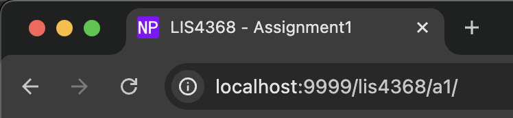

> **NOTE:** This README.md file should be placed at the **root of each of your repos directories.**
>
>Also, this file **must** use Markdown syntax, and provide project documentation as per below--otherwise, points **will** be deducted.
>

# LIS4368 - Advanced Web Applications Development

## Nicholas Pfeffer

### Assignment 1 Requirements:

#### README.md file should include the following items:

* Screenshot of running Hello.java
* Screenshot of running localhost:9999
* Screenshot of index.jsp
* Screenshot of AMPPS running http://localhost
* Screenshot of Android Studio - My First App

#### Git commands w/short descriptions:

1. git init - Initializes a new git repo in the working directory with an accompanying .git subdirectory

2. git status - Prints the status of any currently pending changes within the repo

3. git add - Followed by a specifier to determine which files to include in the next commit

4. git commit - Catalogs file changes with an accompanying commit message to describe any updates

5. git push - Pushes any local repo commits to a remote repo

6. git pull - Pulls changes made in a remote repo into a local repo (git fetch>git merge)

7. git branch - With arguments, can either list, create, or delete branches of a git repo

#### Assignment Screenshots:

*Screenshot of java Hello.java running*:

*Screenshot of localhost:9999 running*:

*Screenshot of index.jsp running*:

