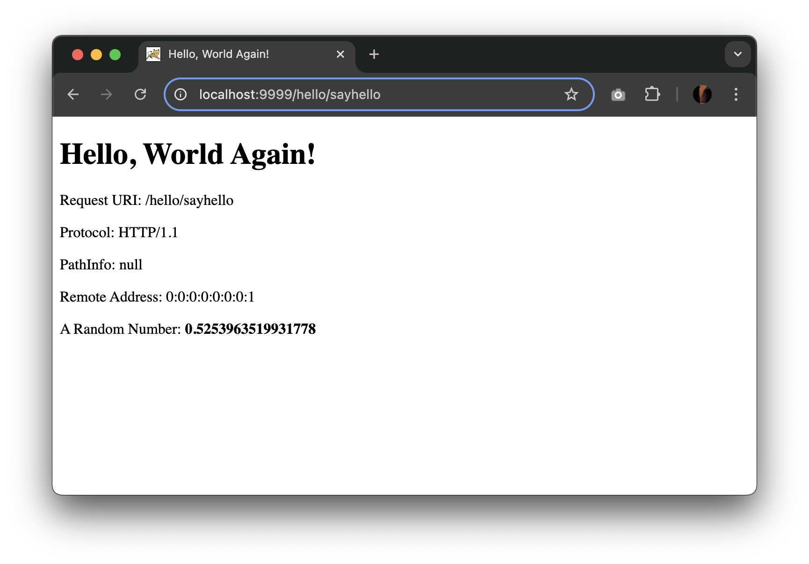
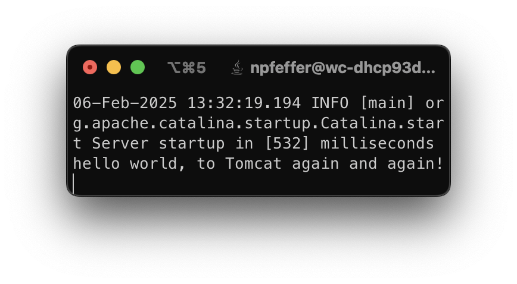
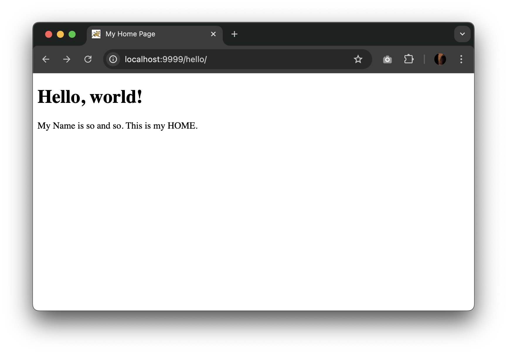
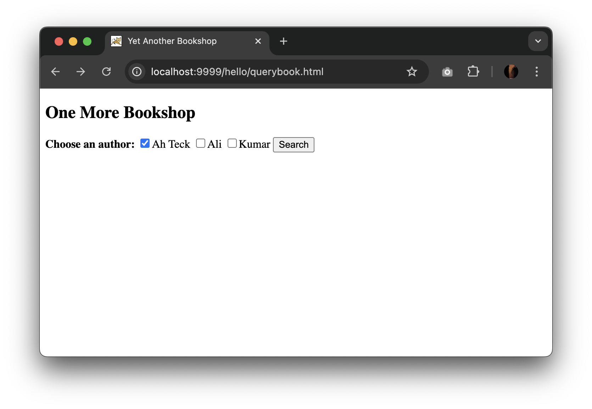
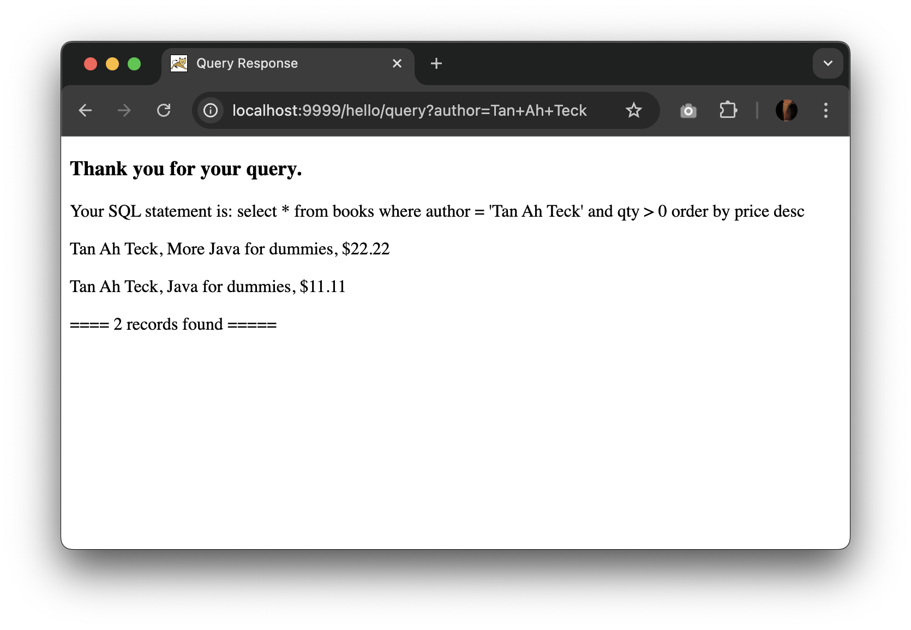
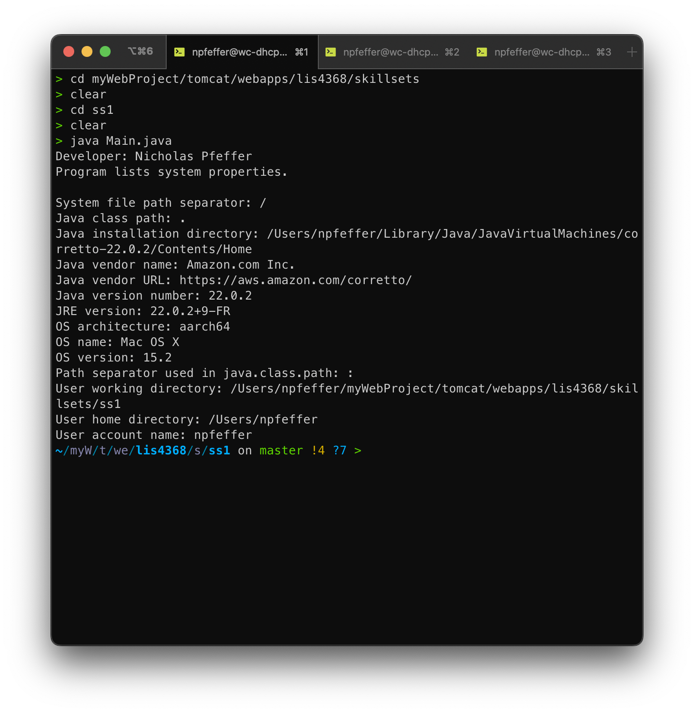
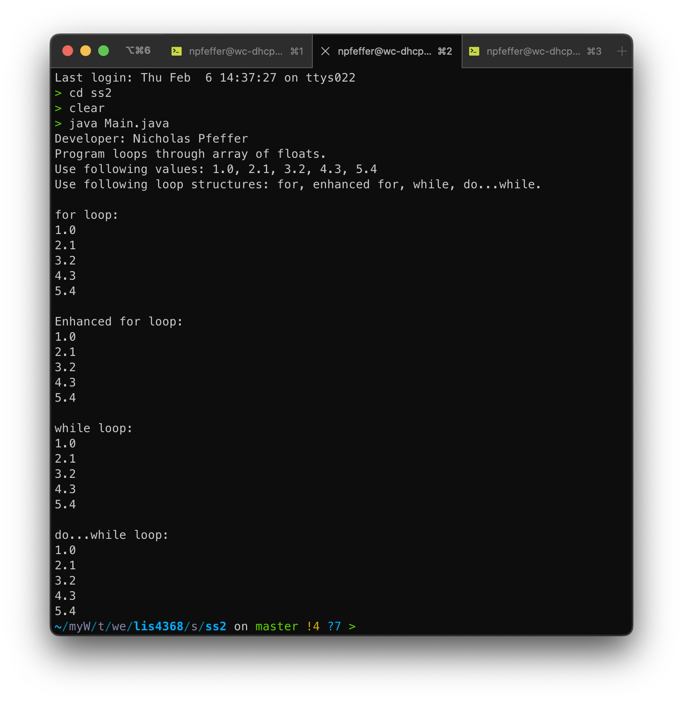
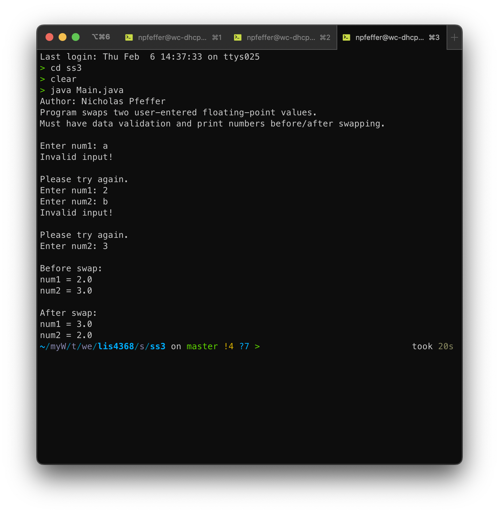

# LIS4368 - Advanced Web Applications Development

## Nicholas Pfeffer

### Assignment 2 Requirements:

* Create a Java servlet "sayhello"
* Establish a MySQL db connection with Java "QueryServlet"
* Complete skillsets 1-3

#### README.md file should include the following items:

* Screenshot of running servlet sayhello
* Screenshot of hello/index.html
* Screenshot of db connection servlet
* Screenshot of db servlet response
* Screenshot of a2/index.jsp

#### Assignment Screenshots:

*Screenshot of java sayhello servlet*:

*Screenshot of tomcat console log*:

*Screenshot of default /hello route*:

*Screenshot of db connection servlet querybook.html*:

*Screenshot of db connection servlet response*:

*Screenshot of skillsets 1-3*:

| Skillset 1 | Skillset 2 | Skillset 3 |
|------------|------------|------------|
|  |  |  |