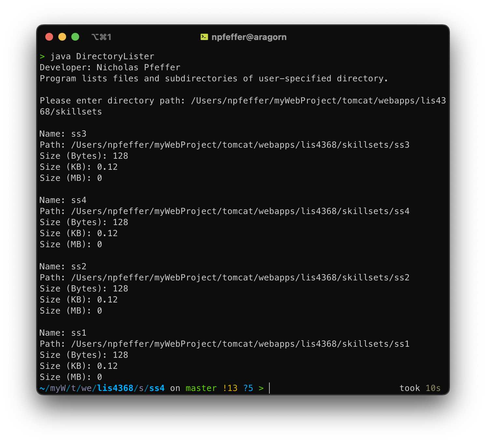
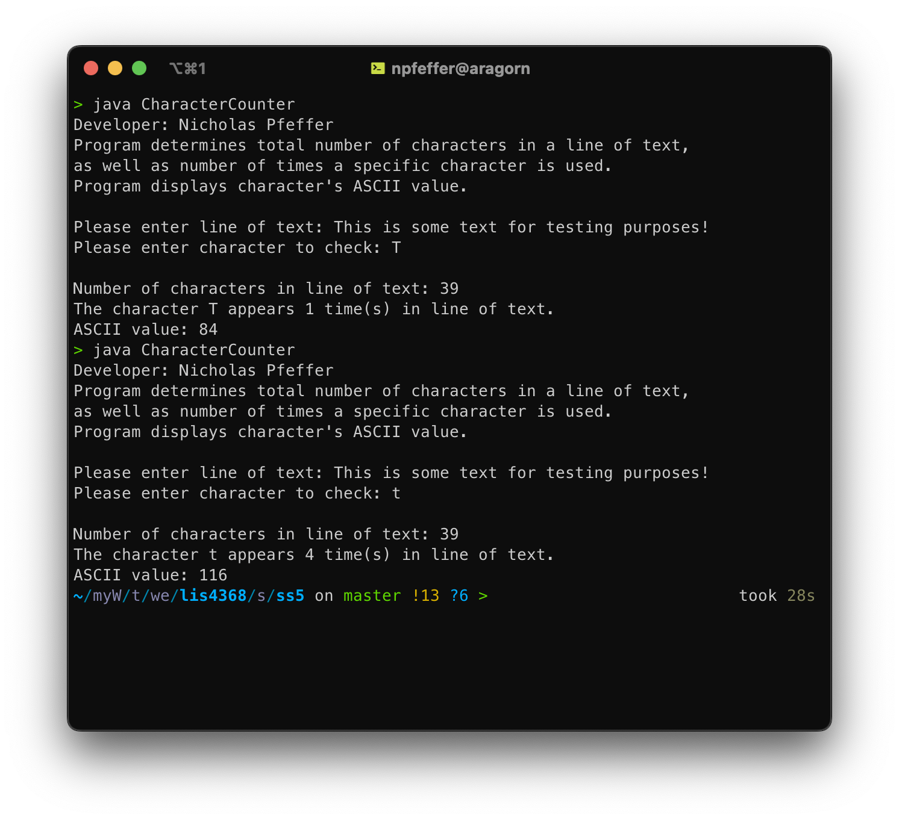

# LIS4368 - Advanced Web Applications Development

## Nicholas Pfeffer

### Assignment 3 Requirements:

* Create a petstore schema
* Engineer an ERD based on the petstore
* Populate schema with 10 records per-table
* Complete skillsets 4-6

#### README.md file should include the following items:

* Screenshot of A3 ERD
* Link to A3.sql file
* Link to A3.mwb file

#### Assignment Screenshots:

*Screenshot of A3 ERD*:

*Screenshot of skillsets 4-6*:

| Skillset 4 | Skillset 5 | Skillset 6 |
|------------|------------|------------|
|  |  |  |

#### Assignment Documents:

* [A3.sql](./docs/A3.sql)
* [A3.mwb](./docs/A3.mwb)