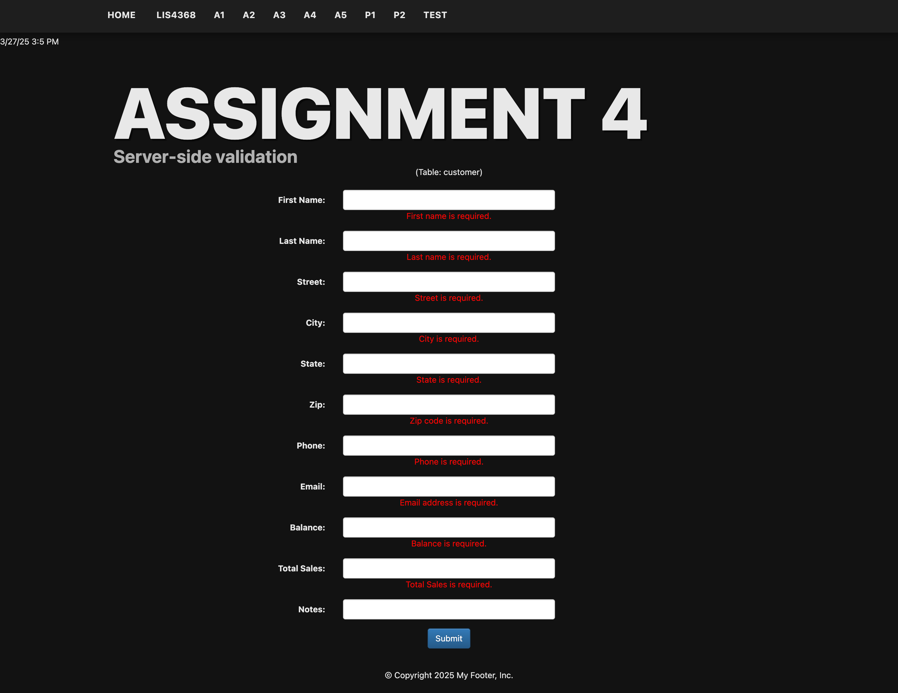
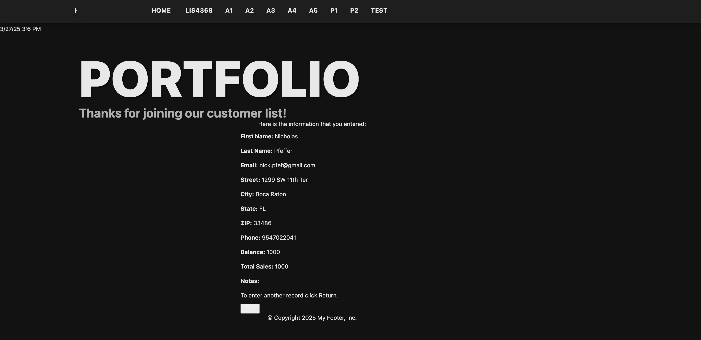
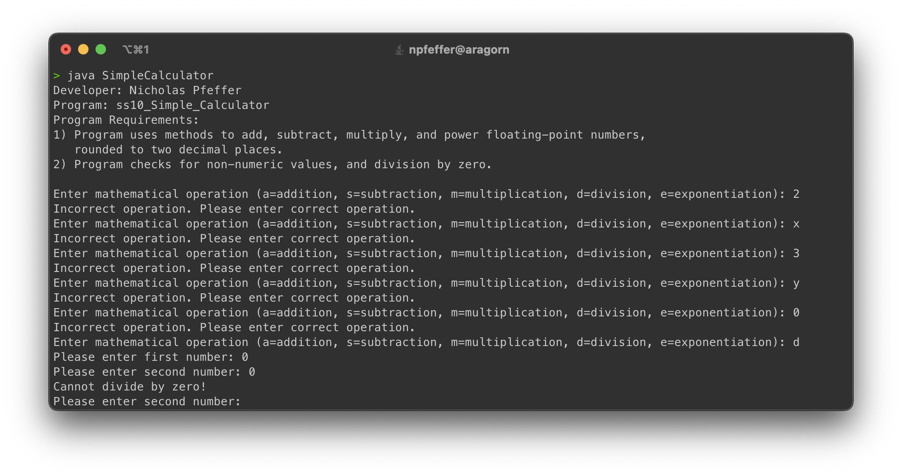
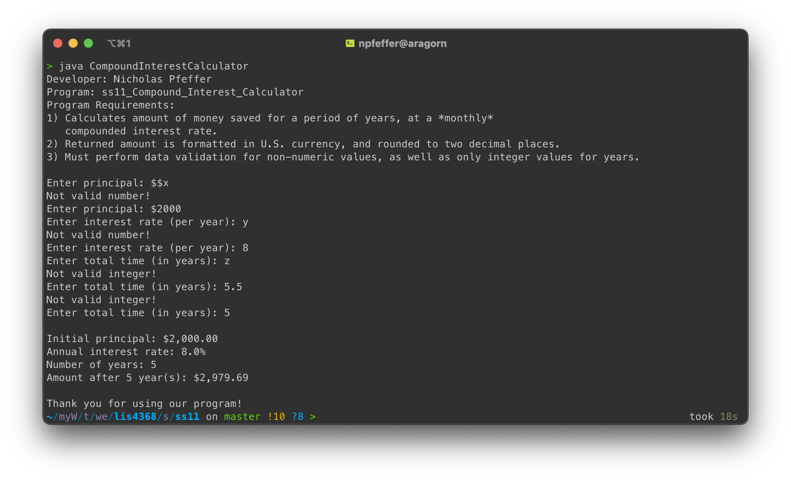
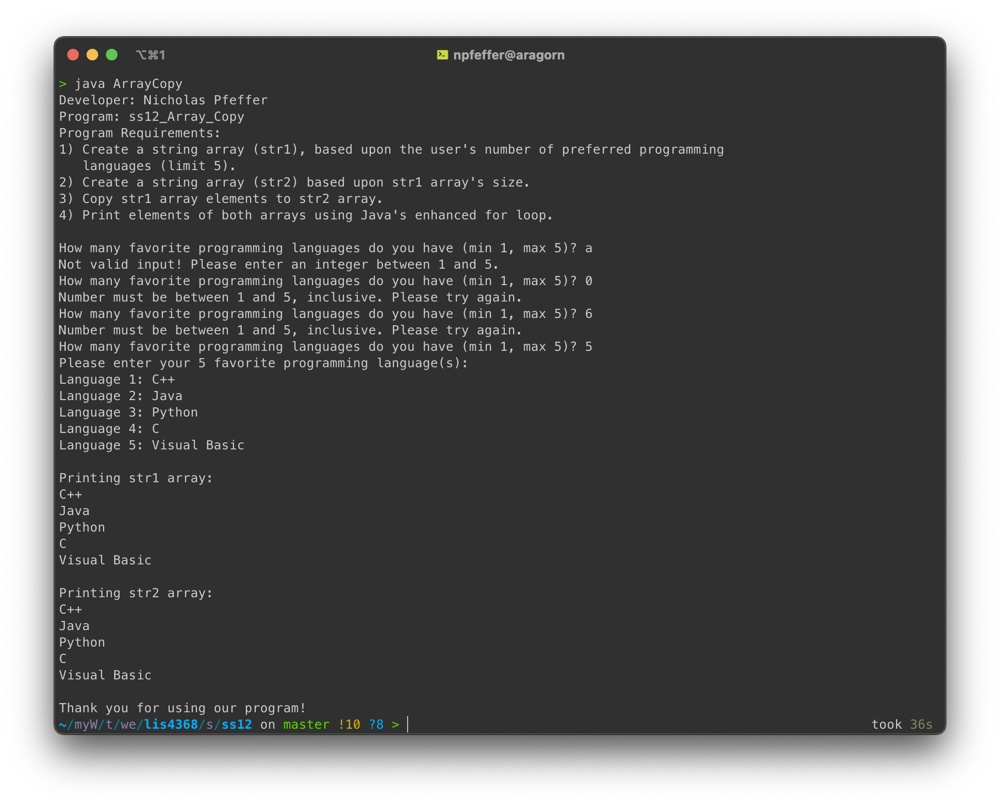

# LIS4368 - Advanced Web Applications Development

## Nicholas Pfeffer

### Assignment 4 Requirements:

* Create and compile customer java servlets
* Design regex for server-side validation
* Ensure data is displayed through thanks.jsp
* Complete skillsets 10-12

#### README.md file should include the following items:

* Screenshot of failed validation for form fields
* Screenshot of succesful validation for form fields on next page
* Screenshots of skillsets

#### Assignment Screenshots:

*Screenshot of failed validation*:

*Screenshot of succesful validation*:

*Screenshot of skillsets 10-12*:

| Skillset 10 | Skillset 11 | Skillset 12 |
|------------|------------|------------|
|  |  |  |