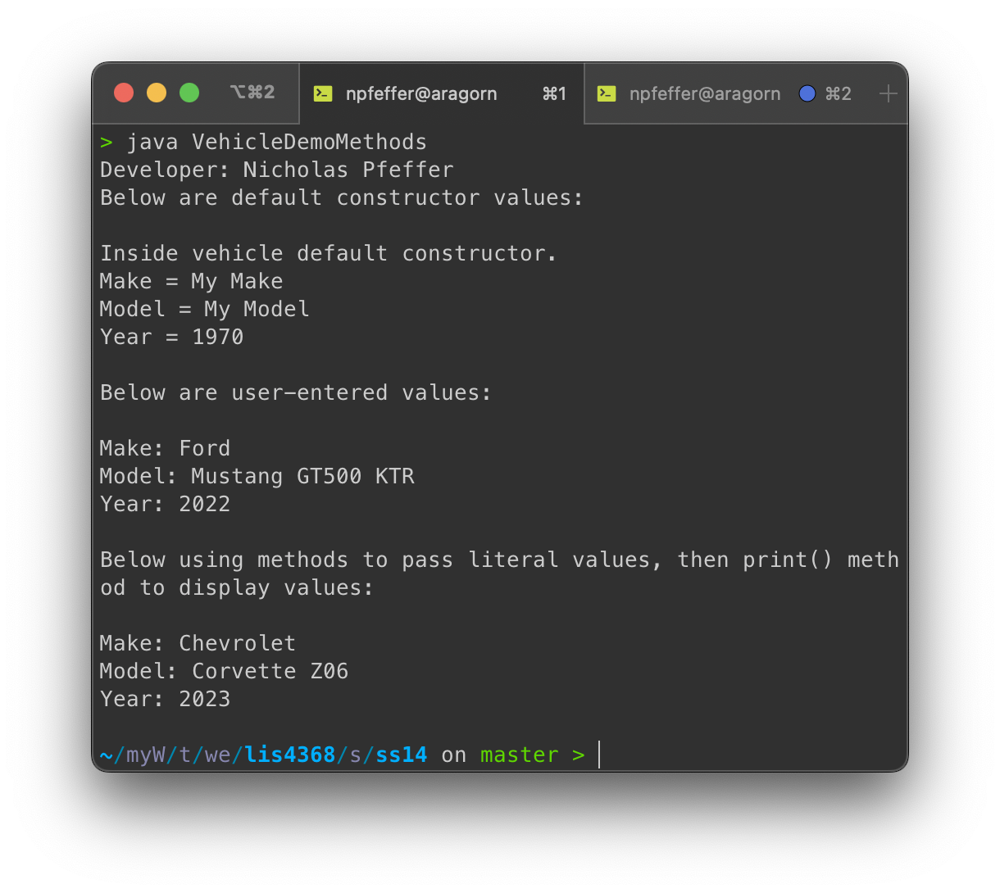

# LIS4368 - Advanced Web Applications Development

## Nicholas Pfeffer

### Assignment 5 Requirements:

* Create and compile customer java servlets
* Connect form to servlet
* Ensure passed information is displayed
* Check SQL for data population
* Complete skillsets 13-15

#### README.md file should include the following items:

* Screenshot of valid input
* Screenshot of passed validation
* Screenshot of SQL population
* Screenshot of skillsets 13-15

#### Assignment Screenshots:

*Screenshot of valid input*:

*Screenshot of passed validation*:

*Screenshot of SQL population*:

*Screenshot of skillsets 10-12*:

| Skillset 13 | Skillset 14 | Skillset 15 |
|------------|------------|------------|
|  |  |  |