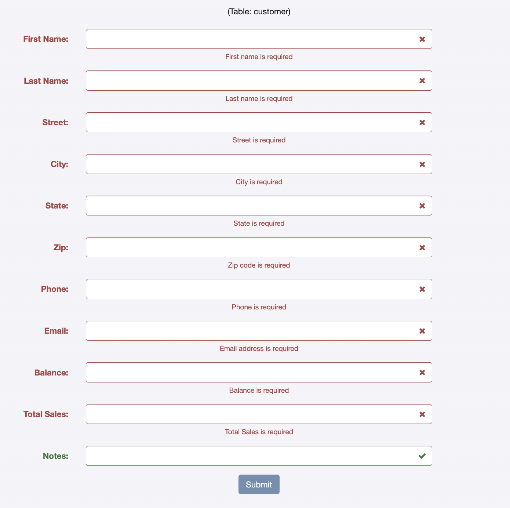
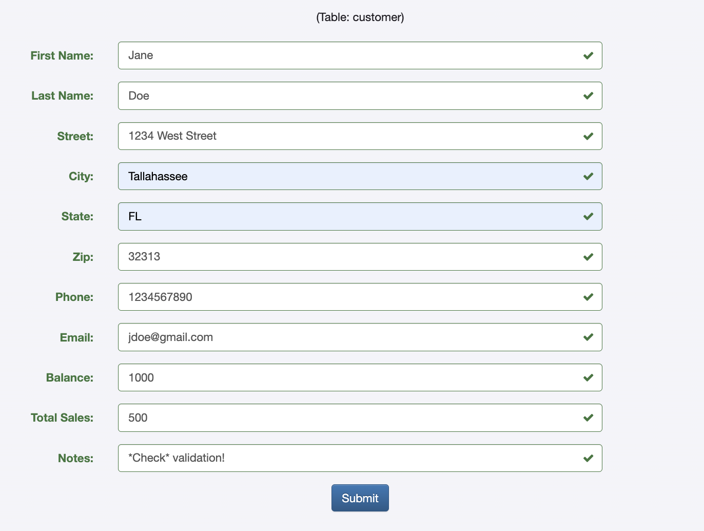
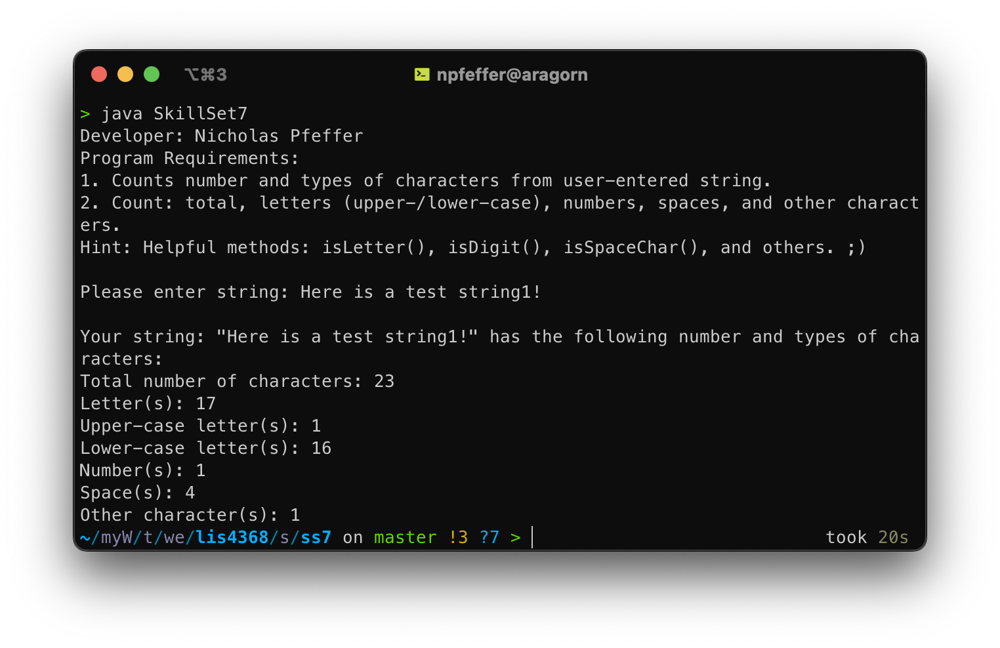
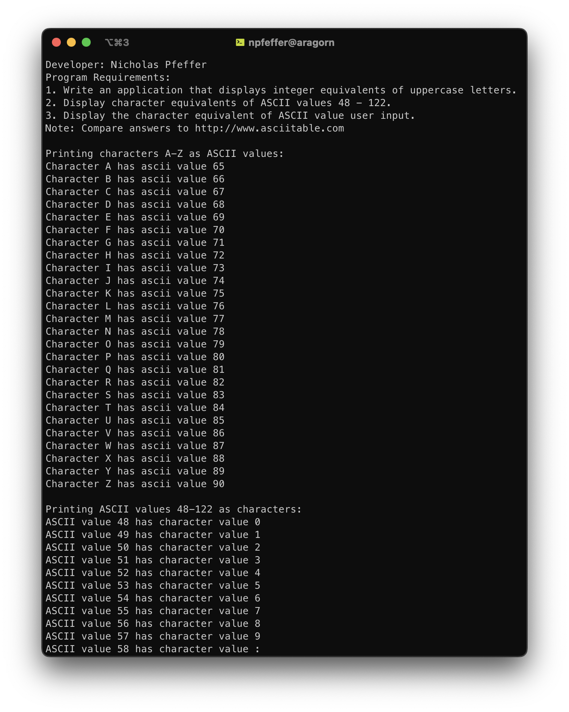
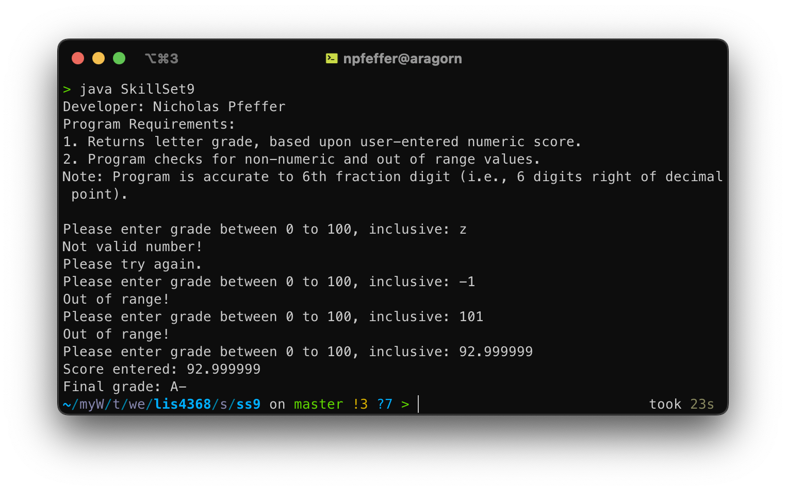
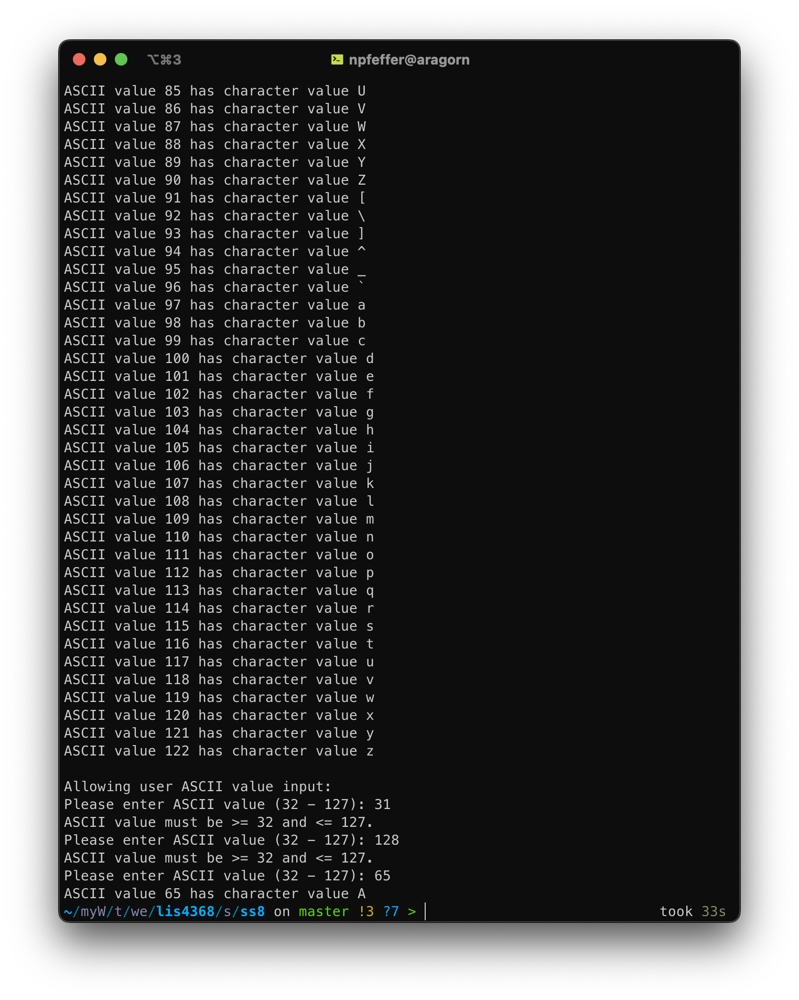

# LIS4368 - Advanced Web Applications Development

## Nicholas Pfeffer

### Project 1 Requirements:

* Create form controls suitable for the customer table
* Use regular expressions to impose client-side validation for forms
* Use the HTML5 property to limit character lengths in fields
* Complete skillsets 7-9

#### README.md file should include the following items:

* Screenshot of empty fields
* Screenshot of valid field entries
* Screenshots of skillsets 7-9

#### Assignment Screenshots:

*Screenshot of Failed Validation*:

*Screenshot of Passed Validation*:

*Screenshot of skillsets 7-9*:

| Skillset 7 | Skillset 8 | Skillset 9 |
|------------|------------|------------|
|  |  |  |
|            |  |            |
